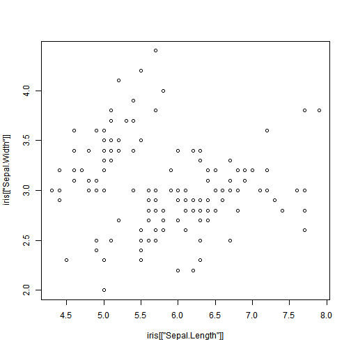

## Overview

This presentation provide an overview of the Shiny application
that was developed as part of the course requirments for 
Developing Data Projects.

It contains the following:

1. Overview of the application
2. Overview of the IRIS dataset
3. Details of online application
4. Instructions for use

---

## Overview of the application
1. The shiny application can be used to view IRIS dataset variables plotted against each other.
2. It was developed using the Shiny toolset.
3. Shiny allow publishing the application live on the Internet.

---

## Overview of the IRIS dataset

The Iris flower data set or Fisher's Iris data set is a multivariate data set introduced by Sir Ronald Fisher (1936) as an example of discriminant analysis. It is sometimes called Anderson's Iris data set because Edgar Anderson collected the data to quantify the morphologic variation of Iris flowers of three related species. 

Two of the three species were collected in the Gaspé Peninsula "all from the same pasture, and picked on the same day and measured at the same time by the same person with the same apparatus".

(source Wikipedia)

--- 

## Details of online application

The online application will plot IRIS data against each other as below


```r
plot(x=iris[["Sepal.Length"]], y=iris[["Sepal.Width"]])
```

 

--- 

## Instructions for use

Browse to the following url: https://knldemo.shinyapps.io/shiny_project/

1. Select the X parameter
2. Select the y parameter
3. The system will plot the variables.

